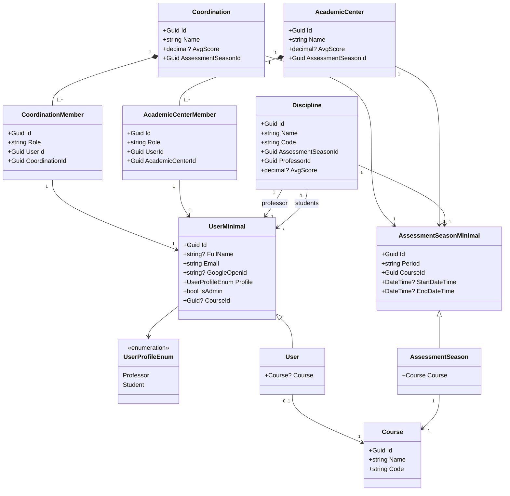

# Domain Model

Class diagram of the core domain entities (`Core/Domain`). DTOs and records are omitted — this shows only the runtime model that services operate on.

## Notes

- **`UserMinimal`** is the base projection of a user used by aggregates (`CoordinationMember`, `AcademicCenterMember`, `Discipline`). **`User`** is the full form that includes the resolved `Course`.
- **`AssessmentSeasonMinimal`** is the base projection used by aggregates. **`AssessmentSeason`** is the full form that includes the resolved `Course`.
- `Coordination` and `AcademicCenter` carry an `AvgScore` populated by the scoring pipeline.
- `Discipline` references the professor via `UserMinimal` and a separate `Students` list of `UserMinimal`.
